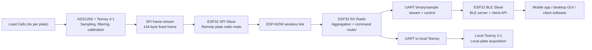
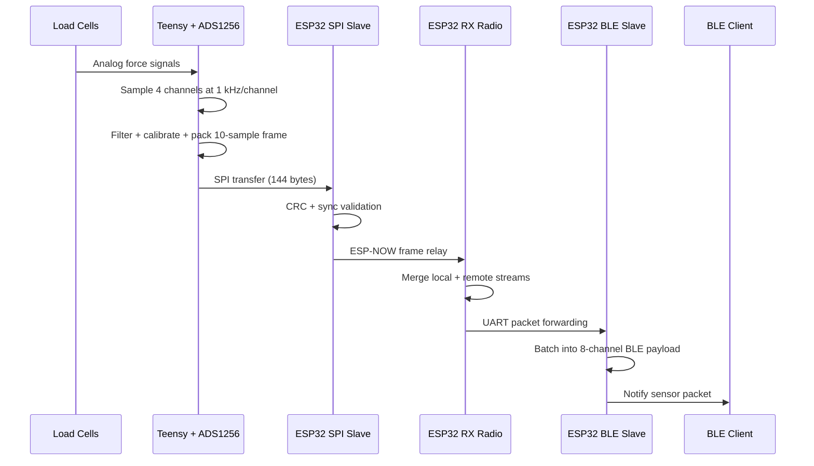
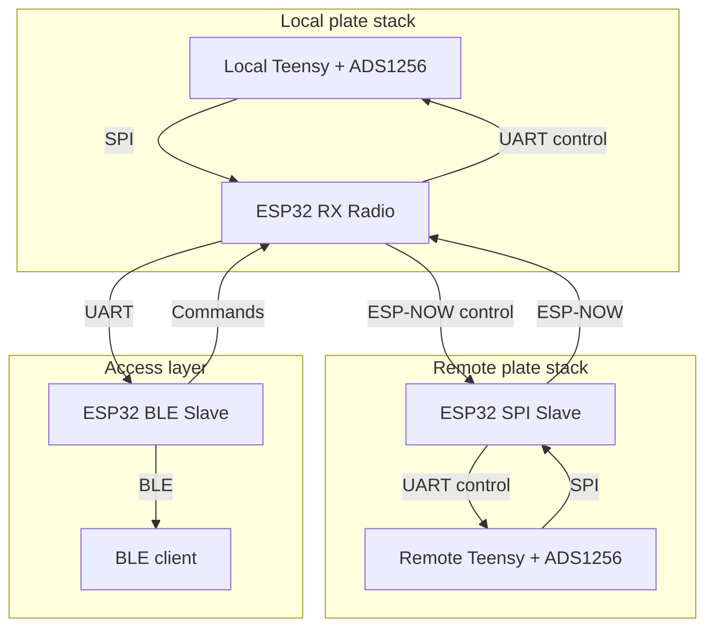
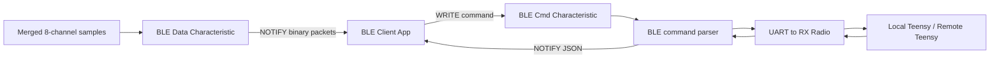
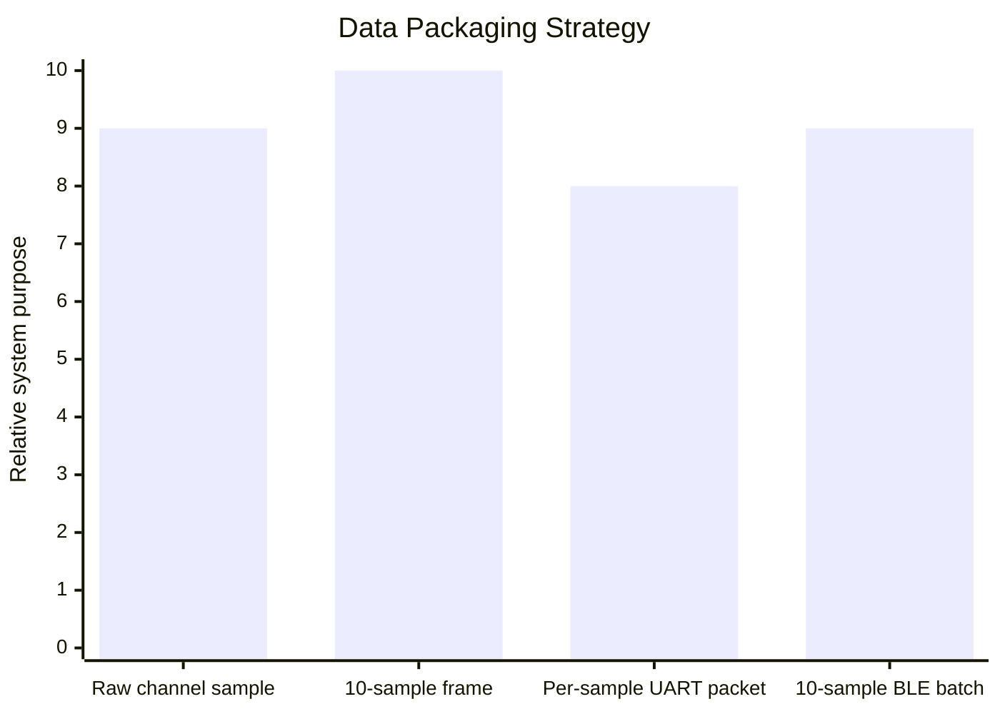

# Force Plate Embedded System

## What is a force plate?

A **force plate** (or force platform) is a device that measures the ground reaction forces and moments produced when a person or object stands, walks, jumps, or performs other movements on its surface. It is widely used in biomechanics, sports science, rehabilitation, and research to quantify balance, gait, jump performance, and loading. Each plate typically uses several **load cells** (strain-gauge or similar sensors) to capture vertical and sometimes horizontal forces; the electronics then sample these signals at high rates (often hundreds to thousands of Hz) and stream or record the data for analysis.

To get a broader picture of how force plates are used in practice, you can read more here:

- [Force plate (Wikipedia)](https://en.wikipedia.org/wiki/Force_plate) — definition, history, and typical applications
- [Ground reaction force (Wikipedia)](https://en.wikipedia.org/wiki/Ground_reaction_force) — the physical quantity force plates measure
- [Force plate analysis in sport (external overview)](https://www.scienceforsport.com/force-plates/) — use in testing and performance

---

This project is a custom force plate platform built as a distributed embedded system rather than a single sensor board. The design combines a high-resolution analog front end, deterministic MCU-level data acquisition, wireless synchronization between two plate nodes, battery telemetry, and a BLE access layer for client applications. The result is a portable measurement system that can stream eight load-cell channels, expose calibration and control interfaces, and coordinate local and remote hardware in real time.

At the sensing layer, each plate is built around a Teensy 4.1 running a custom ADS1256 acquisition stack. The Teensy samples four load-cell channels, applies filtering and calibration, batches the measurements into a fixed 144-byte frame, and pushes that frame over SPI to an ESP32 radio board. The code is structured so that the Teensy remains the timing-critical source of truth for sensor data, while the ESP32 devices handle transport, orchestration, and client connectivity.

The architecture shows a strong combination of embedded firmware, digital communications, signal conditioning, and system integration. It is not just sensor code. It is a full hardware-software stack with clearly separated responsibilities across MCUs.

### System architecture

The hardware hierarchy is intentionally layered:

1. The analog measurement layer lives on the Teensy plus ADS1256, where the load-cell signals are converted into calibrated digital values.
2. The transport layer lives on the ESP32 radio nodes, where the 144-byte plate frames are received, checked, queued, and forwarded.
3. The coordination layer lives mainly in the RX radio, which merges local and remote sample streams, forwards commands, and manages status traffic.
4. The client access layer lives in the BLE slave, which turns the embedded system into a product-facing interface with BLE services, notifications, and JSON command responses.

That hierarchy is a good reflection of system-level engineering discipline: time-critical work stays close to the converter, while network and application concerns are pushed outward.

## System Behavior

Each Teensy produces the canonical frame format:

- `sync[2]`
- `plate_id`
- `proto_ver`
- `frame_idx`
- `t0_us`
- `samples[120]`
- `crc16`
- `pad[12]`

The frame contains 10 samples, with 4 channels per sample, packed as signed 24-bit values. In the current firmware, sampling is scheduled at 4 kHz total, which yields 1 kHz per channel. Once 10 complete sample sets are collected, the Teensy immediately transmits the frame to the ESP32 over SPI at 10 MHz. This keeps frame timing deterministic and reduces software jitter.

The remote side uses an `ESP32 SPI Slave` as the wireless edge node. It receives the Teensy frame through SPI slave DMA queues, validates sync and CRC, and pushes the frame into a network transmit queue. From there, the node transmits the frame over ESP-NOW. The code also supports Wi-Fi UDP transport, but the current configuration is ESP-NOW, which is a smart choice for low-overhead device-to-device communication.

The `ESP32 RX Radio` acts as the system coordinator. It has two jobs at the same time:

- It behaves as an SPI slave for the local Teensy, receiving local plate frames directly.
- It behaves as the wireless receiver for remote plate frames arriving over ESP-NOW.

That means the RX radio becomes the data fusion and command-routing layer. It converts both local and remote 144-byte frames into per-sample UART packets, tracks the latest data for both sides, merges the two four-channel sets into an eight-channel representation, and forwards them downstream to the BLE node.

The `ESP32 BLE Slave` is the client-facing endpoint. It exposes:

- a BLE data characteristic for the binary sample stream
- a BLE command characteristic for writes plus notifications
- a standard battery service for automatic client compatibility
- a device information service for product metadata

This turns the embedded platform into something a phone app, Python GUI, or custom client can discover and control without needing direct knowledge of the lower-level MCU topology.

## Communication Topology

The main data path is:

`Load Cells -> ADS1256/Teensy -> SPI -> ESP32 radio node -> ESP-NOW -> ESP32 RX radio -> UART -> ESP32 BLE slave -> BLE client`

The command path runs in the opposite direction:

`BLE client -> BLE slave -> UART -> RX radio -> Local Teensy or Remote ESP-NOW node -> Remote Teensy`

Battery and status telemetry also travel alongside the data path:

- each radio-side ESP32 reads battery information over I2C from the BQ25792 charger / power-management device
- the remote node sends battery packets to the RX radio over ESP-NOW
- the RX radio forwards combined battery data to the BLE slave over UART
- the BLE slave exposes that information through both a standard battery characteristic and JSON command responses

From a networking perspective, this is best described as a dual-node wireless embedded network with a central aggregation node. It has some mesh-like behavior because the remote node exchanges commands, responses, and telemetry through the coordinator, but it is not a true multi-hop self-routing mesh. That distinction actually helps the portfolio story: the system favors deterministic routing, known peers, explicit MAC addressing, and predictable latency over general-purpose mesh complexity.

## Engineering Skill Sets Demonstrated

This codebase shows a broad embedded engineering stack:

| Skill Set | Where It Appears In The Project |
|---|---|
| Real-time embedded firmware | 1 kHz/channel acquisition scheduling, DMA-backed SPI slave queues, FreeRTOS tasks, hardware timers |
| Mixed-signal measurement design | ADS1256 integration, 24-bit sample packing, load-cell calibration, tare handling, signal conditioning |
| Protocol design | Fixed-size binary frame format, UART packet definitions, CRC16 validation, BLE notification schema |
| Multi-MCU system architecture | Clear role split between Teensy acquisition nodes and ESP32 transport/access nodes |
| Wireless embedded networking | ESP-NOW peer setup, custom MAC addressing, remote command/response transport |
| Hardware interface engineering | SPI master/slave links, UART bridges, I2C charger management, BLE GATT services |
| Power-system integration | BQ25792 configuration, SOC estimation, charging-state detection, telemetry reporting |
| Reliability engineering | Sync bytes, CRC checks, queue-based transport, stale-data handling, timeout-based command handling |
| Product-oriented firmware | BLE battery service, JSON API responses, device info service, remote status commands |

More specifically, the code shows these engineering decisions:

- You separated deterministic sampling from nondeterministic wireless and BLE activity.
- You designed compact binary payloads instead of relying only on text protocols.
- You built recovery paths around timeout, queue overflow, stale data, and invalid packet conditions.
- You exposed the system as both an engineering tool and a product surface, which is rare in hobby-level embedded work.
- You handled calibration as part of the deployed firmware, not as a lab-only script.

## What Each Folder Contributes

### `ads_1256_custom_library`

This is the measurement engine. The code initializes the ADS1256, samples four channels, performs filtering, applies calibration regression, manages tare offsets, and builds the 144-byte transport frame. It also handles LED state signaling, command parsing, and platform state transitions such as stopped, starting, running, and stopping.

The strongest skills visible here are:

- precision ADC integration
- real-time scheduling
- numerical calibration workflow design
- low-level signal filtering
- embedded state-machine design
- custom WS2812 status signaling without hiding timing constraints

The library is especially strong because it is not just reading ADC counts. It has an actual measurement pipeline from raw counts to calibrated force values suitable for streaming and user interaction.

### `esp32_spi_slave`

This node sits on the remote plate. It receives the Teensy’s frame stream through SPI slave transactions, validates frames, queues them for radio transmission, and handles remote command execution. It also manages charger telemetry locally and sends battery state to the coordinator.

The engineering strength here is in:

- SPI slave implementation with queued transactions
- wireless transport encapsulation
- remote command forwarding
- embedded battery-management integration
- concurrent task partitioning between acquisition ingress and radio egress

This folder shows that the remote plate is not a passive endpoint. It is an active networked node with measurement, power, and control responsibilities.

### `esp32_rx_radio`

This is the coordinator and bridge. It ingests local data over SPI, remote data over ESP-NOW, and then forwards normalized per-sample packets to the BLE slave over UART. It also routes commands toward the correct target and collects responses back from both local and remote devices.

The strongest engineering signals here are:

- gateway architecture
- transport conversion between SPI, ESP-NOW, UART, and BLE-facing control packets
- dual-source stream aggregation
- command-and-response orchestration across multiple devices
- end-to-end system synchronization

This folder is one of the clearest examples of full-stack embedded thinking in the project because it owns coordination rather than just a peripheral driver.

### `esp32_ble_slave`

This is the product access layer. It exposes the system through BLE services and characteristics, builds JSON responses for commands, batches eight-channel load-cell data into compact BLE packets, and gives a clean interface to external clients. It also exposes battery information through a standard BLE battery service so off-the-shelf BLE tools can inspect system health.

The engineering depth here includes:

- BLE GATT server design
- command API design
- binary data streaming over BLE
- throughput-oriented packet batching
- client interoperability design

This is what makes the whole project presentable as a polished device rather than a development board demo.

## Master-Slave Relationships And Control Hierarchy

There are several master-slave patterns in this design, each used for a different purpose:

| Link | Master | Slave | Purpose |
|---|---|---|---|
| Sensor acquisition SPI | Teensy 4.1 | ADS1256 | Read precision ADC measurements |
| Plate transport SPI | Teensy 4.1 | ESP32 radio node | Push fixed-size force frames downstream |
| Local plate ingress SPI | ESP32 RX Radio host | local frame DMA buffers | Receive local plate frames |
| Remote plate ingress SPI | ESP32 SPI Slave host | remote frame DMA buffers | Receive remote plate frames |
| BLE control path | BLE client | ESP32 BLE Slave | User commands and client access |
| UART command bridge | RX Radio / BLE Slave | target Teensy side | Command forwarding and status exchange |

At the system level, the hierarchy is:

- Teensy owns sensor truth and time-critical measurement generation.
- ESP32 radio nodes own transport and power telemetry.
- RX radio owns cross-node coordination.
- BLE slave owns external client access.

That is a strong architecture because the computational responsibility follows the physical constraints of the hardware.

## BLE Client Access

Client access is handled by the BLE slave board through a custom service and two main characteristics:

- `Data characteristic`: notification-based binary stream for high-rate eight-channel sample data
- `Command characteristic`: write commands in plain text and receive JSON responses back as BLE notifications

The BLE layer gives a client several useful capabilities:

- start or stop local and remote acquisition
- query platform status
- run calibration commands
- read battery information
- ping the local or remote side to measure responsiveness
- subscribe to the live sample stream

The binary data packet is optimized for throughput. Each BLE packet contains up to 10 merged samples, and each sample contains eight signed 16-bit values: four local channels and four remote channels. That means the client sees one synchronized eight-channel stream even though the hardware underneath is distributed across multiple boards and wireless links.

For a portfolio audience, this is a strong product signal: you did not stop at firmware bring-up. You built the application boundary too.

## Reliability And Performance Techniques

Several implementation details make the system stand out from a firmware-engineering perspective:

- fixed-size frames reduce parsing ambiguity and simplify transport
- CRC16 checks are used across frame and packet boundaries
- explicit sync bytes are used to recover binary packet alignment
- DMA-backed SPI slave queues reduce frame loss risk
- queue-based network forwarding decouples acquisition from radio timing
- UART and BLE paths include timeout handling and fallback logic
- battery telemetry is filtered and debounced rather than reported as raw instantaneous readings
- BLE throughput is improved through sample batching and compact 16-bit payloads

The chart above is qualitative rather than measured. It shows how the design progressively repackages the same physical measurement data for the needs of each layer: precision at acquisition, integrity in transport, normalized routing in coordination, and efficient delivery at the client boundary.

## Portfolio Narrative

This project demonstrates the ability to take a hardware concept from sensor interface all the way to a client-consumable connected device. The system spans analog measurement, digital signal conditioning, MCU firmware, wireless communication, power management, protocol design, and product-facing BLE integration. It is a good example of engineering at the boundary between embedded systems and usable hardware products.

It also reflects good architectural judgment. Instead of forcing one microcontroller to do everything, the design distributes responsibilities across specialized nodes:

- Teensy for deterministic sensing and calibration
- ESP32 radio nodes for transport and telemetry
- ESP32 RX radio for orchestration
- ESP32 BLE slave for user-facing connectivity

That separation is exactly the kind of systems thinking that scales from prototype hardware into a credible product platform.

## Suggested Website Copy

I designed and built a distributed force plate system around Teensy 4.1 and ESP32 MCUs, combining high-resolution load-cell acquisition with wireless node coordination and BLE client access. Each plate uses a custom ADS1256 acquisition stack for four channels of calibrated force data, while the ESP32 layer handles SPI transport, ESP-NOW wireless communication, battery telemetry, command routing, and BLE streaming. The final system exposes a synchronized eight-channel data stream to a client application while preserving deterministic sampling at the sensor layer.

From an engineering standpoint, the project brings together precision ADC integration, real-time firmware, multi-MCU architecture, embedded networking, and product-facing protocol design. I implemented fixed-size binary framing with CRC validation, command-and-response routing between local and remote nodes, charger telemetry over I2C, and a BLE API that supports both high-rate streaming and remote calibration workflows. The result is a portable measurement platform that behaves like a finished hardware product rather than a bench prototype.
