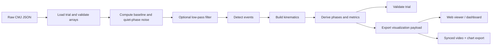
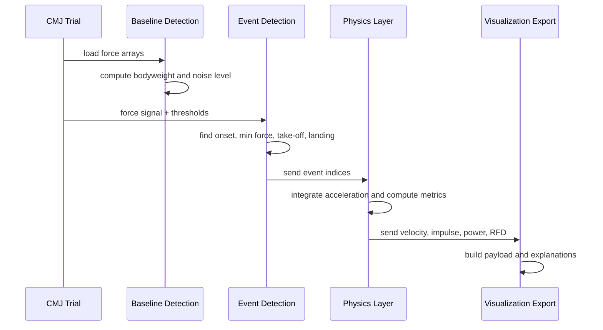
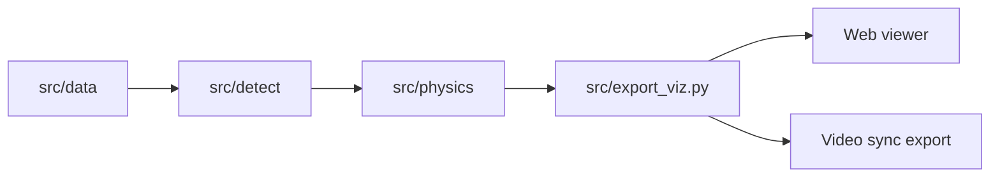

# CMJ Force Plate Analysis

*Turning raw force data into a biomechanics story.*

## What are these jump tests?

**Vertical jump tests** are standard assessments of lower-body power and neuromuscular performance. Athletes jump as high as they can from a standing (or drop) start while force plates record ground reaction force over time. The main types this project supports are:

- **Countermovement jump (CMJ):** A quick downward crouch (countermovement) followed by an explosive upward jump. The pre-load uses the stretch–shortening cycle and typically yields higher jump heights than a jump from a static position.
- **Squat jump (SJ):** The athlete holds a semi-squat position (no countermovement), then jumps. It isolates concentric power without the stretch–shortening contribution.
- **Drop jump (DJ):** The athlete steps off a box (e.g. 30–75 cm), lands on the force plate, and immediately jumps as high as possible. Used to assess reactive strength (e.g. reactive strength index, RSI).

These tests are used in sport science and strength-and-conditioning to profile athletes, monitor training, and assess readiness. To read more about the tests and how they are used:

- [Vertical jump (Wikipedia)](https://en.wikipedia.org/wiki/Vertical_jump) — definition, measurement, and the role of the countermovement
- [Plyometrics (Wikipedia)](https://en.wikipedia.org/wiki/Plyometrics) — jump training and power development context
- [Countermovement jump (Science for Sport)](https://www.scienceforsport.com/countermovement-jump-cmj/) — CMJ procedure and metrics
- [Squat jump (Science for Sport)](https://www.scienceforsport.com/squat-jump/) — squat jump procedure and interpretation
- [Drop jump / Reactive Strength Index (Topend Sports)](https://www.topendsports.com/testing/tests/drop-jump-incremental.htm) — drop jump and RSI testing

---

Most people see a jump as a single motion. This project breaks that motion apart into its mechanical parts: the quiet stance, the countermovement, the braking phase, the concentric push-off, flight, and landing. What makes the project stand out is not just that it plots force over time, but that it turns a raw signal into a structured engineering pipeline with clearly defined events, phases, metrics, validation rules, and a browser-ready export format.

## Project Flow

This is the main idea behind the codebase: each step transforms the same trial data into a more useful representation. The design is intentionally linear, which makes the logic easy to reason about and easy to debug.

## Why this project matters

Countermovement jump analysis is a great example of applied software engineering because it sits at the intersection of signal processing, numerical methods, biomechanics, and product design. The value is not in one formula alone. It comes from the whole system:

- detect meaningful events reliably from noisy real-world data
- reconstruct kinematics from force plate measurements
- compute sports-science metrics that coaches and researchers actually use
- package the result into a format that can power dashboards, reports, and video review tools

That combination makes the project feel production-oriented rather than academic. It is built to answer a practical question: *what happened during this jump, and what does it mean?*

## Detection And Metric Flow

This sequence shows that the project is a pipeline, not a single calculation. Each stage depends on the one before it.

## The engineering approach

At the foundation is a typed data model for each trial. The pipeline starts by loading a structured CMJ record, validating array lengths, and deriving the sample rate and time axis from the raw export. That may sound simple, but it is an important engineering choice: the rest of the system can rely on consistent inputs instead of handling edge cases repeatedly.

From there, the code is organized as a sequence of focused modules:

- `src/data` handles loading and typed trial/event structures
- `src/detect` handles baseline estimation, event detection, phase boundaries, and validity checks
- `src/physics` handles kinematics and biomechanics metrics
- `src/signal` handles optional filtering
- `src/export_viz.py` converts the analysis into a single JSON payload for the viewer
- `src/analysis_response.py` adds human-readable explanations for UI rendering

That separation is a strong software design signal. It keeps the physics logic independent from the visualization layer, and it keeps the visualization payload independent from the CLI workflow.

This dependency graph captures the implementation style. Lower-level modules produce reusable analysis artifacts, and higher-level modules package those artifacts for humans to consume.

## Signal processing and event detection

The most important technical challenge in a force plate workflow is identifying the key points in a signal that is never perfectly clean. This project handles that by combining domain knowledge with robust thresholding.

The pipeline first estimates bodyweight from a quiet weighing window, using the mean of the first second of data and the standard deviation of that segment as a measure of baseline noise. That quiet-phase variance is then used for statistical movement-onset detection. In other words, the code does not guess onset from a fixed number alone. It adapts to the signal quality.

Event detection is built around a few practical rules:

- take-off requires the force to drop below a low threshold for several consecutive samples
- landing requires sustained contact above a higher threshold
- movement onset requires a sustained drop below bodyweight, with a statistical fallback if the noise estimate is weak
- minimum force is found by searching the contact segment for the lowest value

This design is elegant because it is simple enough to be explainable, but robust enough to work on real data. The thresholds are configurable, which means the pipeline can be tuned without rewriting the algorithm.

## Kinematics from force

One of the most interesting parts of the project is how it reconstructs center-of-mass motion from the force signal. Using Newton's second law, the code computes acceleration as:

`a(t) = (F(t) - BW) / m`

Then it integrates acceleration to obtain velocity across the contact phase. That is standard biomechanics in theory, but the implementation shows care: the velocity curve is drift-corrected so that the integrated result matches the expected impulse-based take-off velocity.

That drift correction is a sign of mature numerical thinking. Raw numerical integration over noisy data can accumulate small errors, and those errors matter when you use the output to define eccentric end, velocity zero, and power-related metrics. The project does not ignore that problem. It explicitly compensates for it with a linear ramp correction across the contact window.

## Metrics that are actually useful

The project does not stop at event detection. It computes metrics that matter in training and performance analysis:

- jump height from impulse-momentum
- jump height from flight time as a cross-check
- take-off velocity
- RSImod
- peak power
- peak rate of force development
- eccentric and concentric RFD splits
- phase impulses and durations
- countermovement depth
- left/right asymmetry metrics

This is where the project starts to stand out from a normal data visualization script. The metrics are not random statistics. They are grounded in biomechanics and aligned with how jump performance is evaluated in sport science.

The use of both impulse-momentum and flight-time jump height methods is especially good engineering. It gives the user a primary estimate plus a sanity check. That kind of redundancy increases trust in the output.

## Structure and explainability

The project also does something that many technical tools miss: it makes the analysis explainable.

Instead of returning only numbers, it exports a structured payload containing:

- raw force and time arrays
- phase intervals
- key points
- detected events
- metrics
- validity flags
- human-readable analysis blocks

That payload can be consumed by a browser viewer, an API, or a downstream dashboard without extra transformation. The `analysis_response` layer goes one step further by pairing each phase and metric with a plain-language explanation, which makes the project much more portfolio-friendly and much easier to demo.

## Visualization as part of the product

The charting and video-sync pieces are not just cosmetic extras. They show that the project was designed as a full workflow, not a one-off analysis function.

The browser viewer can render phases and key points directly from the exported JSON. The video compositor can synchronize a jump video with the force chart and export a combined MP4. That means the analysis is usable in a coaching or review setting, where visual context matters as much as the numbers.

From a software perspective, this is a strong signal of product thinking: the analysis is packaged in a way that other people can actually use.

## What The Graphs Show

These diagrams are not decoration. They explain the core idea behind the project:

- raw data becomes a validated trial object
- the trial object flows through detection and physics
- the results are packaged into a structured payload
- the payload powers charts, explanations, and synced video

That flow is the real engineering story of the codebase. It shows you understand how to move from signal processing to a usable product.

## Why it stands out

This project stands out because it combines several skills in one system:

- numerical computing with NumPy and SciPy
- signal filtering and event detection
- applied physics and biomechanics reasoning
- structured data modeling
- JSON export design for front-end consumption
- charting and video synchronization
- explainable analysis for non-technical users

Many projects can do one of those things. Fewer can do all of them while staying coherent. This one does, because the codebase is organized around a clear pipeline: load data, establish baseline, detect events, compute kinematics, derive metrics, validate, and export.

## Deep Dive: Programming And Engineering Skills

This project shows much more than domain knowledge. It demonstrates strong programming habits and systems thinking.

### 1. Modular software design

The codebase is split into small, single-purpose modules instead of one large script. That matters because each layer has a clear responsibility:

- data loading and type safety live in `src/data`
- signal preparation lives in `src/signal`
- event detection lives in `src/detect`
- physics and metric calculations live in `src/physics`
- export and presentation logic live in `src/export_viz.py` and `src/analysis_response.py`

That structure makes the project maintainable. It is easier to test, easier to debug, and easier to extend when new metrics or event rules are added.

### 2. Strong use of typed data models

The project uses dataclasses to describe the trial, detected events, phases, and validity state. That is a real engineering advantage because it turns implicit assumptions into explicit contracts.

For example, the trial model checks that all force arrays match the declared sample count. That kind of validation prevents silent downstream errors and shows careful defensive programming.

### 3. Robust algorithm design

The event-detection logic is not brittle. It combines:

- fixed thresholds for clearly defined biomechanical events
- sustained-sample checks to avoid false positives from noise spikes
- statistical onset detection based on quiet-phase variability
- fallback logic when the signal is too noisy for the primary rule

This is a good example of practical algorithm design. The code does not depend on a single perfect condition. It uses layered rules so the analysis still works on imperfect real-world data.

### 4. Numerical programming with awareness of error

The physics layer uses numerical integration to move from force to acceleration, then acceleration to velocity, and velocity to displacement. That is not just formula translation. It is careful scientific programming.

The drift correction step is especially important. It acknowledges that numerical integration of noisy data can drift away from the physically expected result, and it corrects that drift in a controlled way. That shows an understanding of numerical stability, not just implementation.

### 5. Good API and data-pipeline thinking

The output is designed as a structured payload, not just a console printout. That means the analysis can be reused by:

- a browser viewer
- a dashboard
- an API endpoint
- a report-generation workflow
- a video-sync tool

That is a strong sign of software maturity. The project is built like a backend service, even though it is also useful as a local analysis tool.

### 6. Explainability and product thinking

The project does a good job of turning technical analysis into something people can actually understand. The payload includes explanations for phases, key points, and metrics, which means the system is not only correct but communicative.

That is a valuable engineering skill: knowing how to make advanced analysis accessible without losing rigor.

### 7. Configurable and reusable implementation

The CLI supports filtering and threshold tuning instead of hardcoding every assumption. That makes the pipeline flexible enough for different signal qualities and different use cases.

From a coding perspective, this means the implementation is not locked to one dataset or one lab setup. It is parameterized and reusable.

## What These Skills Signal

Taken together, the project shows that you can:

- design clean Python modules with clear boundaries
- write data-processing code that is both scientific and maintainable
- handle noisy inputs with robust detection logic
- use numerical methods responsibly
- build exportable analysis outputs for other software systems
- think beyond code execution and into user experience

That combination is powerful for a portfolio. It says you are not just someone who can write scripts. You can build software that is structured, reusable, explainable, and ready to integrate into real products.

## What this says about the builder

If you put this on a portfolio, it communicates a very specific skill profile:

- you can work with noisy real-world data
- you understand how to turn domain rules into software logic
- you care about correctness, not just presentation
- you can design pipelines that are reusable and inspectable
- you can bridge backend analysis with front-end visualization

That is the kind of project that signals engineering maturity. It shows you can build something that is technically grounded, readable, and useful.

## Closing thought

The strongest thing about CMJ Force Plate Analysis is that it treats a jump as both a scientific measurement and a software product. The result is a system that not only calculates metrics, but explains them, visualizes them, and packages them for real workflows. That balance of rigor and usability is what makes the project memorable.
